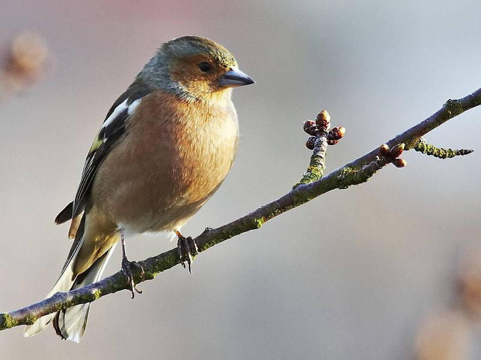

```{r setup, include=FALSE}
knitr::opts_chunk$set(echo = FALSE,
                      warning = FALSE,
                      message = FALSE,
                      fig.retina = 3)
```

```{r packages}
library(tidyverse)
library (bookdown)
library (kableExtra)
library (flextable)
library (gt)
library (devtools)
library(citr)
```

# Introduction
Chaffinches, *Fringilla coelebs*, are common to UK woodland, farmland, parks, and gardens [@Woodland_Trust_undated-gv]. The average weight of a chaffinch is 18-29g [@noauthor_undated-dy]. The masses of a group of finches were taken and categorised by sex, to see how this varied from this known average. See Figure \@ref(fig:malechaff-fig)

(ref:malechaff-fig) A male chaffinch. Photo taken by Michael Apel, CC BY 2.5, https://en.wikipedia.org/wiki/Common_chaffinch#/media/File:Fringilla_coelebs_male1.jpg


```{r malechaff-fig, out.height='200px', fig.cap= '(ref:malechaff-fig)'}


```


# Methods
The chaffinches data was imported and tidied

```{r data tidying, echo = TRUE}
#read in the data
chaff <- read.table("~/R Workshop/chaff02/data-raw/chaff.txt", header = T)

#tidying the data
chaff2 <- gather(data = chaff, key = sex, value = mass)

#write the tidied data into a new file
write.table(chaff2, file = '~/R Workshop/chaff02/data/tidychaff.txt', row.names = FALSE)
```

Summarising the data

<!-- this way doesn't take into account the groups, so is less useful  -->

```{r ss(x) version 1, include = FALSE}
sum_sq <- function(df, measure) {
  df %>% summarise(ss = sum(({{measure}} - mean({{measure}}))^2))
}

sum_sq(chaff2, mass)
```

<!-- this does do it by group -->

```{r ss(x) by group, echo = TRUE}
sum_sq <- function(df, measure, group) {
  df %>% group_by({{ group }}) %>% 
    summarise(ss = sum(({{measure}} - mean({{measure}}))^2))
}

sum_sq(chaff2, mass, sex)

```

```{r mean,length, sd, echo = TRUE}
chaff2 %>% group_by(sex) %>% 
  summarise(mean = mean(mass),
            n = length(n),
            sd = sd(mass),
            se = sd/sqrt(n))
```

This can also be done in 1 function

```{r summary in 1 function, echo = TRUE}
data_summary <- function(df, measure, group) {
  df %>% group_by({{ group }}) %>% 
    summarise(mean = mean({{measure}}),
            n = length(n),
            sd = sd({{measure}}),
            se = sd({{measure}})/sqrt(length(n)),
            ss = sum(({{measure}} - mean({{measure}}))^2))
}

chaff3 <- data_summary(chaff2, mass, sex)
```

```{r t test}
t.test(data = chaff2,
       mass ~ sex,
       var.equal = T)
```
<!-- p = 0.01175 so there is a significant difference -->

# Results

<!-- extract the values so they can be used in the report (regardless of what data is used, so it can be reproducible) -->

```{r extracting values}
highestmean <- max(chaff3$mean)
highestmeanse <- chaff3$se[chaff3$mean == highestmean]
highestmeansex <- chaff3$sex[chaff3$mean == highestmean]
```

Of the two groups, it was the `r highestmeansex` with the greater mean mass ($\bar{x} \pm s.e.$: `r round(highestmean, 2)` $\pm$ `r round(highestmeanse, 2)` g)

The results from summarising the chaffinches data, grouping by sex. See table \@ref(tab:chaff-table)

```{r chaff-table}
knitr::kable(chaff3 [,-3],
             digits = 2,
             caption = 'Chaffinch masses by sex',
             row.names = FALSE,
             col.names = c('Sex', 'Mean mass' ,'Standard deviation', 'Standard error', 'Sum squared'))
```

The results can also be shown as a table. See figure \@ref(fig:mass-fig)

(ref:mass-fig) A graph showing the means and standard errors for the mass of each sex

```{r mass-fig, fig.height = 4, fig.width = 4, fig.cap = '(ref:mass-fig)'}

ggplot() +
  geom_point(data = chaff2, aes(x = sex, y = mass),
             position = position_jitter(width = 0.1, height = 0),
             colour = "turquoise") +
  geom_errorbar(data = chaff3, 
                aes(x = sex, ymin = mean - se, ymax = mean + se),
                width = 0.3) +
  geom_errorbar(data = chaff3, 
                aes(x = sex, ymin = mean, ymax = mean),
                width = 0.2) +
  scale_y_continuous(name = expression("Mass g"), 
                     limits = c(15, 27), 
                     expand = c(0, 0)) +
  scale_x_discrete(labels = c("Female", "Male"), 
                   name = "Sex") +
  theme_classic() +
  theme(axis.title = element_text(size  = 10),
        axis.text = element_text(size = 10))
```


# Discussion


# References


